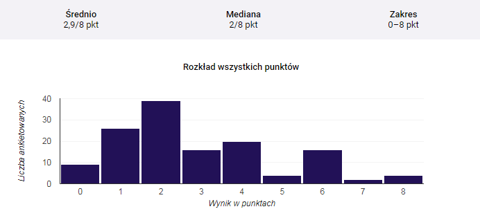

Postanowiłem, że przedstawię wam wyniki testu C++, który jest od dłuższego czasu dostępny na [Coders School][1]. Niestety wyniki te są dla mnie zatrważające. Przygotowując ten test niecały rok temu, stwierdziłem że umieszczę w nim pytania praktyczne i przekrojowe. Takie pytania, które sam zadałbym na rozmowie rekrutacyjnej, gdybym miał zatrudnić do pracy osobę świeżo po studiach. W teście jest tylko 8 pytań i tylko jedna poprawna odpowiedź na każde pytanie. Miałem nadzieję, że rozkład punktów będzie rozkładem Gaussa i najwięcej będzie wyników w okolicach 50%. Ale rzeczywistość jest inna.

Poniżej prezentuję rozkład wyników testu C++ na dzień dzisiejszy, czyli 12 lipca 2018.

[2]

**Jest niepokojąco dużo wyników rzędu 1 lub 2 punkty**. Mediana wyników wynosi 2, a średnia 2,9 punkta. W teście wzięło udział póki co 136 osób.

Nie wiem czy mogę wyniki testu C++ interpretować tak, że na tę stronę zaglądają głównie osoby, które chcą się uczyć języka C++. Swoje kursy kieruję mimo wszystko do osób z wiedzą akademicką, czyli takich, które pisały już coś w języku C++ np. na studiach, ale nie mają jeszcze doświadczenia komercyjnego. Wiem jednak jakie są realia na kierunkach informatycznych i niestety nie uczą one dokładnie tego, czego oczekują pracowadcy od absolwentów. Przykładowo, standard języka **C++11**, który **ma już 7 lat** nie jest zbytnio wspominany na uczelniach, a w sposób znaczący zmienił on sposób programowania w języku C++.

**Wdrożenie i nauka absolwenta do pracy w firmie często trwa nawet 3 miesiące. Jest to realny koszt dla pracodawcy**. Zanim absolwent będzie produktywny i będzie mógł samodzielnie dostarczać dobrej jakości rozwiązania, zazwyczaj mija dużo czasu.

Dużo osób pyta mnie też o kurs języka C++ od podstaw. Ja jednak polecam samodzielną naukę podstaw z kursów online dostępnych w internecie. Są 2 bardzo dobre i co ważne, **darmowe** kursy online w języku polskim. Zawsze polecam przerobienie tych kursów wszystkim swoim kursantom przed rozpoczęciem kursu u mniej. Są to [Kurs C++ Mirosława Zelenta][3] oraz [Kurs Obiektowego C++ Mirosława Zelenta][4]

Jeśli chcesz się przetestować to zapraszam do [testu języka C++][1]. A jeśli chcesz się doszkolić, aby łatwiej było Ci znaleźć pracę jako programista C++ to zgłoś zainteresowanie kursem C++ online lub stacjonarnym. Najbliższa edycja planowana jest na październik/listopad 2018.

 [1]: https://coders.school/sprawdz-sie/
 [2]: https://coders.school/wp-content/uploads/2018/07/test.png
 [3]: http://miroslawzelent.pl/kurs-c++/
 [4]: http://miroslawzelent.pl/kurs-obiektowy-c++/
