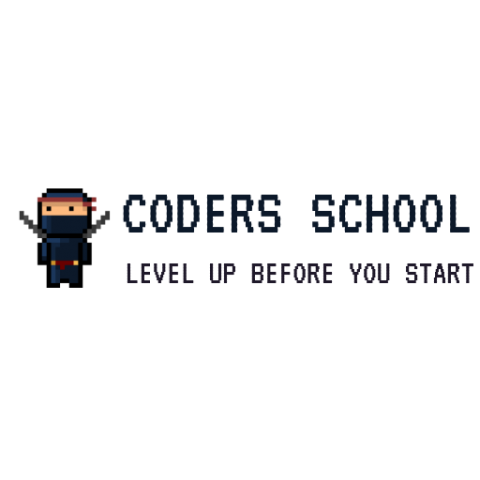

## Organizacja

W październiku planujemy pierwszą edycję kursu programowania w języku Java. Kurs ten pozwoli na poszerzenie znajomości Javy i dobrych praktyk dla przyszłych programistów. Jest on dedykowany wszystkim osobom, które mają podstawowe doświadczenie w programowaniu, znają podstawy programowania obiektowego i chciałyby w przyszłości rozpocząć pracę jako programista Java. Wszystkie szczegóły zostaną ustalone do końca sierpnia 2018. Kurs programowania Java będzie dostępny tylko dla jednej grupy:

* start 7 października 2018
* spotkania po 4 godziny w soboty
* od 10:00 do 14:00
* 12 spotkań
* max 12 osób

## Koszty

Kurs Javy stanowi poszerzenie naszej oferty. Pierwsza edycja dostępna jest w promocyjnej cenie *1500 zł* (30 zł za godzinę).

Domyślnie zakładamy płatności w comiesięcznych ratach. Do kursu wlicza się w sumie 50 godzin wspólnych spotkań, nielimitowana liczba godzin spędzonych na projektach grupowych i indywidualnych oraz nielimitowany czas konsultacji online.

**Pierwsze zajęcia** z systemu kontroli wersji git **będą darmowe** i uczestnictwo w nich nie będzie powodowało obowiązku uczestniczenia w całym kursie. Zajęcia te odbędą się jednak w większym gronie.

## Formy zajęć

Kurs Java dla przyszłych programistów będzie odbywać się w nietypowy sposób, gdzie każde zajęcia mają formę inną od poprzednich, aby pokazać różne techniki pracy programistów. Zastosujemy Pair Programming, Coding Dojo, ćwiczenia symulacyjne, ćwiczenia proceduralne, Code Review, Continuous Integration i parę innych rzeczy. Poznamy też Scruma 🙂

W samym kursie bardzo duży nacisk położony jest na pracę w grupie podczas tworzenia projektów grupowych. Tej umiejętności brakuje bez wyjątku każdej osobie, która samodzielnie uczyła się programowania albo opuściła mury uczelni.

## Tematyka kursu

* Narzędzia programisty
* Standardy pisania kodu
* Scrum
* Wyjątki
* Generyki
* Zarządzanie pamięcią i garbage collector
* Praca z kolekcjami, funkcyjne przetwarzanie strumieni danych
* Testy jednostkowe i TDD
* Nowoczesna java 8+
* Dobre praktyki programistyczne (KISS, DRY, YAGNI, SOLID)
* Szablony
* Ile powinieneś zarabiać, dobre CV, porady rekrutacyjne

Opcjonalnie po zakończeniu kursu można zdecydować się na symulacje rozmów kwalifikacyjnych - indywidualnie 2 h, 350 zł. Po takiej rozmowie od razu dostajesz informację zwrotną o tym jak Ci poszło i nad czym musisz poprawcować, aby lepiej wypaść.

Po kursie istnieje możliwość polecenia najlepszych uczestników do pracy w dobrych projektach.Jeśli interesują Cię tylko niektóre wybrane lekcje z [naszej oferty][2], również zapraszamy do kontaktu.

## Wymagania

* język angielski na poziomie B1
* znajomość podstaw programowania obiektowego, w celu odświeżenia wiedzy lub nauczenia się podstaw polecamy darmowy kurs online [Kurs Java - Kobiety do kodu][3] (świetna strona nie tylko dla kobiet 😉

## Zgłoszenia na kurs Java

Zgłoszenia na kurs przyjmujemy na 3 sposoby:

* napisz maila na <pawel@coders.school>
* zadzwoń pod 721 158 313
* wypełnij formularz zgłoszeniowy

 [2]: https://coders.school/oferta/
 [3]: https://kobietydokodu.pl/kurs-javy/
