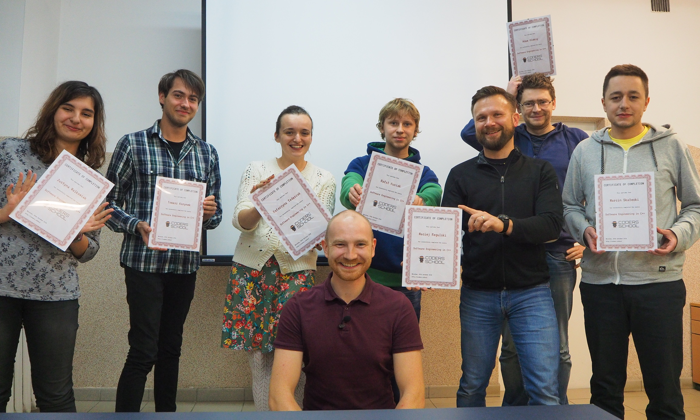

Dwie grupy kursantów właśnie ukończyły kurs programowania w języku C++ w Coders School. Rekruterzy, mam niezwykle mocnych kandydatów na stanowiska juniorskie (a nawet wyższe), którzy wiedzą i doświadczeniem przebiją studentów uczelni wyższych.

<!--more-->

Letnia edycja kursu programowania C++ rozpoczęła się w lipcu, a zakończyła właśnie teraz, wraz z końcem października. O rozpoczęciu kursu informowałem [tutaj][1]. Przez 4 miesiące wspólnie uczyliśmy się o szczegółach działania i używania języka C++ takich jak:

* obiektowość w C++
* biblioteka **STL** - kontenery, iteratory, funktory, algorytmy
* nowoczesny C++ - **C++11, C++14, C++17**
* zarządzanie pamięcią - **smart pointery, wycieki pamięci**, valgrind
* testowanie z bibliotekami **gtest, gmock, catch**
* szablony

Jednakże większa część tematów nie była związana ściśle z językiem C++, lecz z szeroko pojętą inżynierią oprogramowania, do której zaliczały się:

* narzędzia programisty - **git, make, cmake, kompilatory, vim**
* programowanie zorientowane obiektowo
* **testowanie** kodu - testy jednostkowe, TDD
* **debuggowanie** z użyciem konsolowego debuggera gdb
* wzorce projektowe
* zasady Clean Code - **SOLID, DRY, KISS, YAGNI**
* dobre praktyki programistyczne - **Continuous Integration, Code Review, Coding Dojo, Pair Programming**

Ale sama wiedza to nic. W dzisiejszych czasach bez doświadczenia znalezienie pracy jako programista jest niesamowicie trudne. Na szczęście w czasie trwania kursu wiedza była utrwalana u kursantów poprzez projekty grupowe. Praca w nich była zorganizowana w metodologii **Scrum**. Pracowaliśmy zespołowo współdzieląc kod na **[GitHubie][2]**.

Zaznaczę też bardzo ważną rzeczą - nasi absolwenci kursu C++ mieli wcześniej wiedzę programistyczną, także tę na temat programowania obiektowego. Nasz kurs nie był od zera, tak jak większość popularnych dzisiaj kursów. Wymagana była uczelniana wiedza na temat programowania. Na kursie poszerzyliśmy tę wiedzę przygotowując kursantów z tematyki wymaganej przez każdego pracodawcę, który poszukuje programistów C++.

Absolwenci kursu są w większości chętni do podjęcia pracy od zaraz. Jeśli poszukujesz bardzo mocnych kandydatów na stanowisko młodszego programisty C++ to zapraszam do [kontaktu][3]. Warto się spieszyć, gdyż niektórzy z kursantów dostali już pracę podczas trwania kursu 🙂

 [1]: https://coders.school/post/wystartowala-edycja-wakacyjna-kursu-c/
 [2]: https://github.com/csGroupProjectcs/Bowling
 [3]: https://coders.school/kontakt/